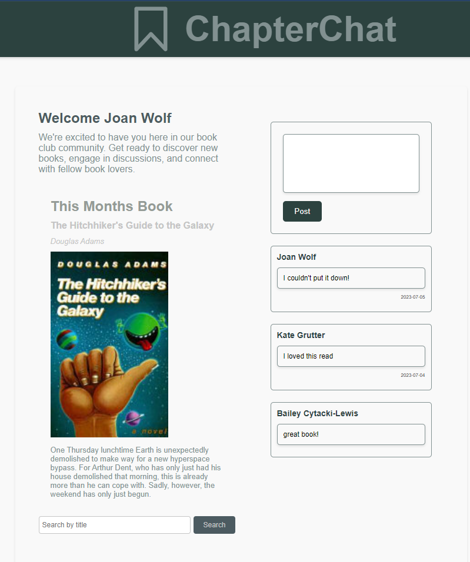
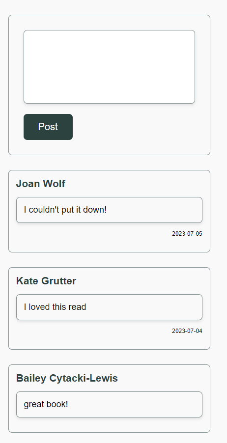
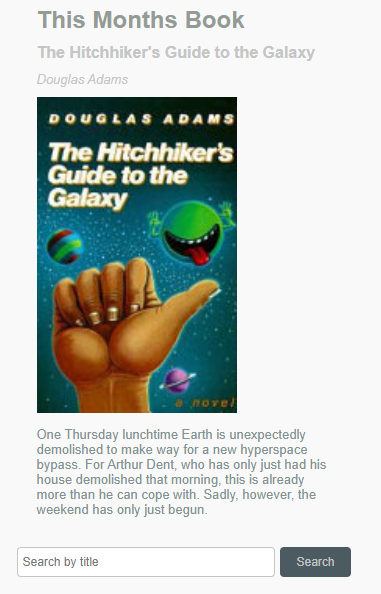

# ChapterChat

This discussion board app is a must-have for book clubs! Both in-person and virtual.

A wonderful and convenient way for book club members to connect in real time to discuss the book that they're reading.

The ChapterChat team wanted to present book clubs with a way to connect easily in between meetings. Have a thought mid-read? Post it in the chat to keep track of your thoughts and connect with other club members! Our app makes it easy to remember the current book of the month, track past reads, and invite members to the next meeting. Don't lose momentum during your read!

## Motivation

The members in our group are in book clubs (some of them are in more than one), and found that there wasn't a good way to keep track of past reads, or to remember thoughts that they had while reading. This app seeks to connect friends, as well as help you find and connect with new friends, as you bond over your love of reading.

## Screenshots

## Technology Used

This project was generated with React version 18.2.0, HTML, CSS, JavaScript (ES6), and TypeScript.

## API used

GoogleAPI
